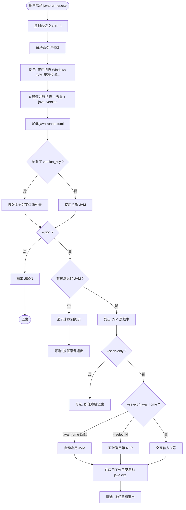
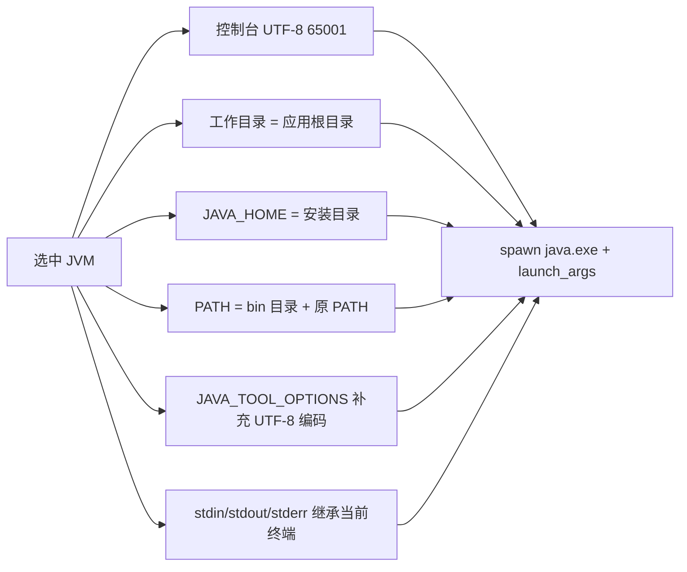
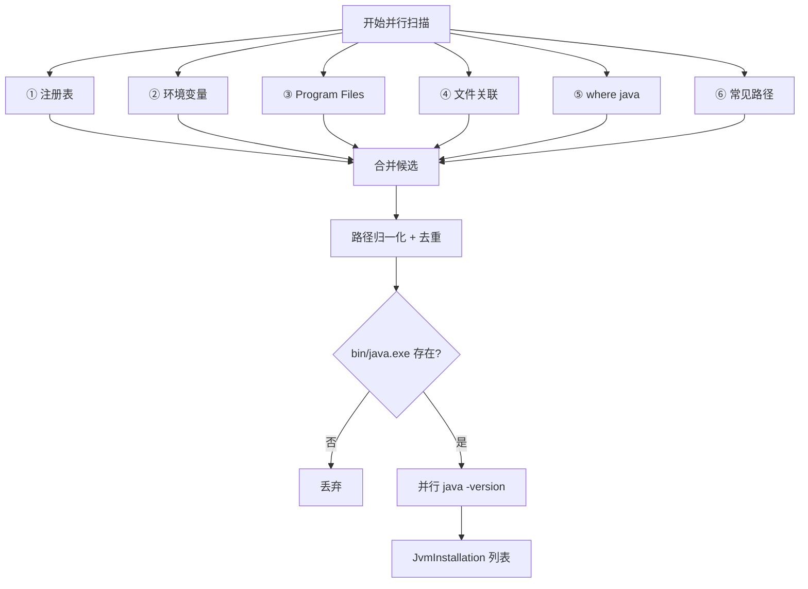
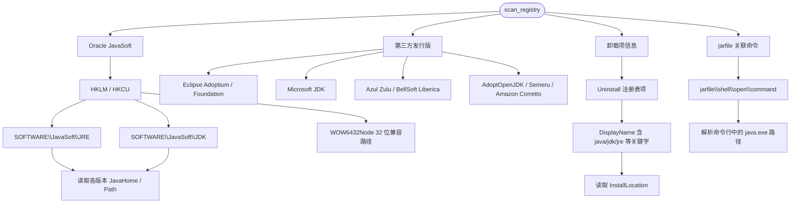
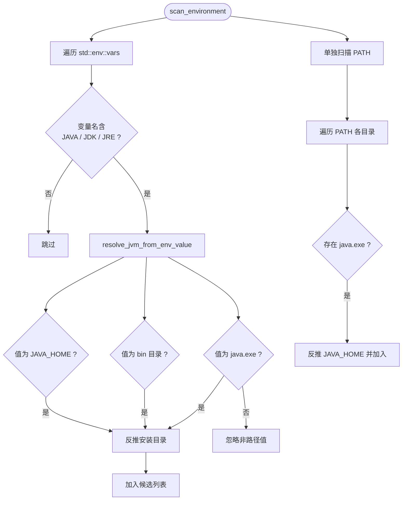
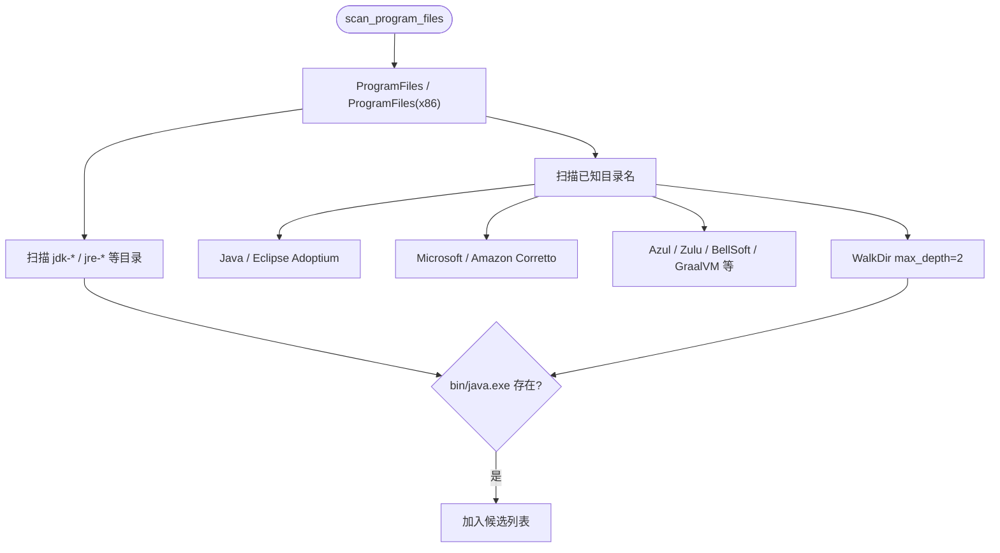
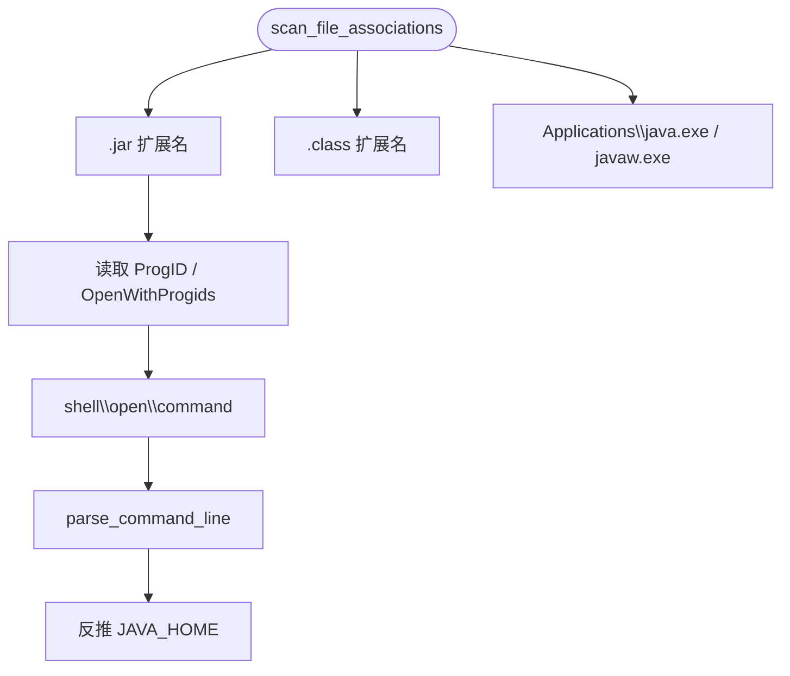
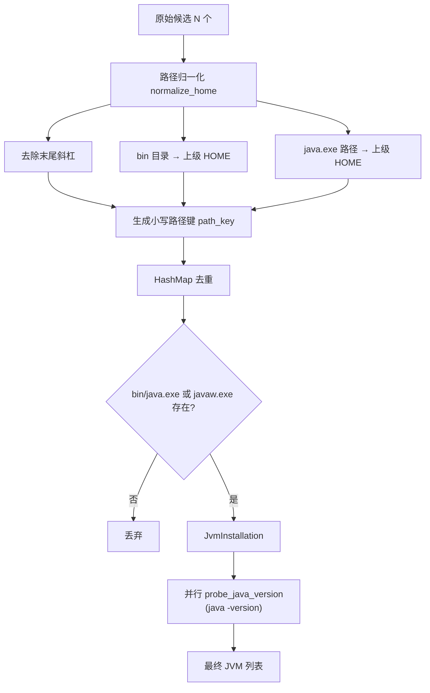

# java-runner 使用与实现指南

> 英文版：[guide_en.md](guide_en.md) · 构建后 HTML/PDF 输出至 `dist/doc/`（发布包内为 `doc/`）

Windows 命令行工具：扫描本机 JVM 安装位置，选择（或自动匹配）其中一个，并在**当前终端**用该 JVM 运行可配置的 Java 启动命令。

---

## 总体流程



---

## 命令行参数

| 参数 | 说明 | 影响交互 |
|------|------|----------|
| `--json` | 以 JSON 格式输出扫描结果 | 跳过选择、启动、等待按键 |
| `--scan-only` / `-s` | 仅扫描并列出 JVM | 跳过选择与启动 |
| `--verbose` / `-v` | 显示每个 JVM 的发现来源 | 列表/JSON 更详细 |
| `--config` / `-c` | 指定配置文件路径 | 影响启动命令与工作目录 |
| `--select N` | 直接选择第 N 个 JVM（从 1 开始） | 跳过交互输入；优先级高于 `java_home` |
| `--no-pause` | 执行完成后不等待按键 | 适合终端/脚本 |

**常用示例：**

```powershell
java-runner.exe                          # 默认交互
java-runner.exe --scan-only              # 仅列出 JVM
java-runner.exe --select 3               # 直接使用第 3 个
java-runner.exe --json                   # 脚本输出
java-runner.exe --json -v                # JSON 含发现来源
java-runner.exe --config my.toml         # 指定配置
java-runner.exe --no-pause               # 不等待按键
```

---

## 语言与国际化

程序根据 **Windows 用户区域设置**（`GetUserDefaultLocaleName`）自动选择界面语言：

| 系统区域 | 界面语言 |
|----------|----------|
| `zh*`（如 `zh-CN`、`zh_CN`） | 中文 |
| 其他区域 | 英文 |

可通过环境变量 **`JAVA_RUNNER_LANG`** 强制指定（如 `zh-CN` 或 `en-US`）。`--help`、扫描提示、交互提示、错误信息等用户可见文本均会随语言切换；`--json` 输出的字段名保持英文。

```powershell
$env:JAVA_RUNNER_LANG = 'en-US'
java-runner.exe --help

$env:JAVA_RUNNER_LANG = 'zh-CN'
java-runner.exe --scan-only
```

---

## 配置文件

### 查找顺序

指定 `--config` 时使用给定路径；否则按顺序查找**第一个存在的文件**：

1. `{exe 所在目录}/java-runner.toml`
2. `{exe 所在目录}/config/java-runner.toml`
3. `./java-runner.toml`（当前工作目录）
4. `./config/java-runner.toml`

均未找到时使用内置默认：`launch_args = ["-version"]`。

### 工作目录

启动 Java 时，子进程的当前目录（`current_dir`）按以下规则确定：

- 配置文件为 `…/config/java-runner.toml` → 应用根目录为 `config` 的**上一级**
- 配置文件为 `…/java-runner.toml` → 应用根目录为配置文件**所在目录**
- 无配置文件 → 优先 `exe` 所在目录

因此 `-jar app.jar`、相对路径日志（如 `logs/gc.log`）均相对于应用根目录解析。

### 配置项

| 配置项 | 类型 | 说明 |
|--------|------|------|
| `java_home` | 字符串（可选） | 安装路径**片段**，不区分大小写；匹配成功后自动选用，跳过交互 |
| `version_key` | 字符串（可选） | 版本关键字；仅保留 `java -version` 输出（version/product/runtime/vm）中包含该关键字的 JVM |
| `launch_args` | 字符串 **或** 字符串数组 | `java.exe` 之后的参数列表 |

**`launch_args` 写法：**

```toml
# 数组（推荐，清晰）
launch_args = ["-Xmx512m", "-jar", "magic-boot-1.0.jar"]

# 单字符串（长参数一行写完；含空格参数可用引号包裹）
launch_args = "-version"

# 单引号字面量（Windows 路径推荐；避免 \l 等 TOML 转义错误）
launch_args = '-Xmx512m -Xloggc:logs/gc.log -jar magic-boot-1.0.jar'
```

> **注意：** 双引号字符串中的 `\logs` 会被 TOML 当作转义序列导致解析失败，请改用**单引号字面量**或**数组写法**。

### 完整示例（部署 jar 服务）

```toml
# 仅显示 Java 8
version_key = "1.8"

# 自动选用路径中含该片段的 JVM（跳过交互）
java_home = "jdk1.8.0_271"

# 长启动参数（与 run.bat 等效）
launch_args = '-Xmx512m -Xms512m -Xss512k -XX:PermSize=256m -XX:MaxPermSize=256m -Dfile.encoding=UTF-8 -Dsun.jnu.encoding=UTF-8 -Dsun.stdout.encoding=UTF-8 -Dsun.stderr.encoding=UTF-8 -Dlogging.charset.console=UTF-8 -server -Xloggc:logs/gc.log -Dserver.port=10087 -jar magic-boot-1.0.jar'
```

**选择优先级：** `--select N` > `java_home` 自动匹配 > 交互输入序号。

---

## 启动 Java 时的环境设置

选中 JVM 后，启动子进程前会做如下设置：



### 控制台中文乱码

Spring Boot 等框架常以 UTF-8 输出日志，而 Windows 控制台默认 GBK，会出现乱码（如 `褰撳墠澶囦唤…`）。

程序已内置：

1. 启动时将控制台代码页设为 **65001（UTF-8）**
2. 为 Java 子进程设置 `JAVA_TOOL_OPTIONS`，包含 `-Dsun.stdout.encoding=UTF-8`、`-Dsun.stderr.encoding=UTF-8`、`-Dlogging.charset.console=UTF-8` 等

直接双击 **`java-runner.exe`** 即可（程序启动时会自动设置 UTF-8 代码页）；若仍有乱码，请在新开的 CMD 窗口中重试。

---

## 用户交互场景

### 场景一：未发现 JVM

```
正在扫描 Windows JVM 安装位置...

未能检测到该机器安装的java环境，请安装后再执行本程序

按任意键退出...
```

若配置了 `version_key` 但无匹配项，则提示：`未找到版本信息包含 "…" 的 JVM…`

### 场景二：正常交互

```
正在扫描 Windows JVM 安装位置...

共发现 6 个 JVM（候选 25 条，扫描耗时 320ms）

[1] D:\java\jdk1.8.0_271
    java.exe: D:\java\jdk1.8.0_271\bin\java.exe
    版本: 1.8.0_271
    ...

请选择要使用的 JVM（输入序号）:
> 1

使用 JVM: D:\java\jdk1.8.0_271 (1.8.0_271)
执行命令: D:\java\jdk1.8.0_271\bin\java.exe -Xmx512m ... -jar magic-boot-1.0.jar

... Java 程序输出 ...

按任意键退出...
```

### 场景三：`java_home` 自动选用

配置 `java_home = "jdk1.8.0_271"` 后：

```
已按配置 java_home 选用 [6] D:\java\jdk1.8.0_271
使用 JVM: D:\java\jdk1.8.0_271 (1.8.0_271)
执行命令: ...
```

### 场景四：JSON 输出（`--json`）

```json
{
  "count": 6,
  "raw_candidates": 25,
  "elapsed_ms": 320,
  "jvms": [
    {
      "home": "D:\\java\\jdk1.8.0_271",
      "java_exe": "D:\\java\\jdk1.8.0_271\\bin\\java.exe",
      "version": "1.8.0_271",
      "product": "java",
      "runtime": "Java(TM) SE Runtime Environment ...",
      "vm": "Java HotSpot(TM) 64-Bit Server VM ..."
    }
  ]
}
```

加 `--verbose` 时，每个 JVM 额外包含 `sources` 发现来源数组。

---

## 退出与等待按键

| 场景 | 是否等待按键 |
|------|--------------|
| 未发现 JVM | 是（除非 `--no-pause`） |
| `--scan-only` 完成 | 是 |
| Java 程序执行完成 | 是 |
| 运行出错 | 是 |
| `--json` | 否 |
| `--no-pause` | 否 |

---

## JVM 扫描发现流程

程序通过 **6 条并行扫描通道** 收集候选路径，经 **归一化、去重、有效性校验** 得到唯一 JVM 列表，再对每个 JVM 执行 `java -version` 获取真实版本。



### 六条扫描通道概览

| 通道 | 模块 | 发现来源标签 |
|------|------|--------------|
| ① 注册表 | `registry.rs` | 注册表 |
| ② 环境变量 | `environment.rs` | 环境变量 / PATH |
| ③ Program Files | `program_files.rs` | Program Files |
| ④ 文件关联 | `associations.rs` | 文件关联 |
| ⑤ where java | `associations.rs` | where java |
| ⑥ 常见路径 | `common_paths.rs` | 常见路径 |

---

### ① 注册表扫描

从 Windows 注册表读取 Java 安装信息，覆盖 Oracle 官方及主流发行版。`--verbose` 模式下可看到具体注册表路径。



| 扫描项 | 注册表位置示例 | 读取字段 |
|--------|----------------|----------|
| Oracle JRE/JDK | `HKLM\SOFTWARE\JavaSoft\JDK\<version>` | `JavaHome`、`Path`、`InstallationPath` |
| Eclipse Adoptium | `HKLM\SOFTWARE\Eclipse Adoptium\JDK\<version>` | `Path`、`JavaHome` |
| Microsoft JDK | `HKLM\SOFTWARE\Microsoft\JDK\<version>` | `Path`、`JavaHome` |
| Azul Zulu | `HKLM\SOFTWARE\Azul Systems\Zulu\<version>` | `InstallationPath`、`JavaHome` |
| 卸载项 | `HKLM\...\Uninstall\{GUID}` | `InstallLocation`（DisplayName 需含 Java 关键字） |
| JAR 关联 | `HKCR\jarfile\shell\open\command` | 命令行字符串 |

每条通道同时扫描 **HKLM、HKCU** 及 **WOW6432Node**（32 位兼容）路径。

---

### ② 环境变量扫描

遍历当前进程可见的全部环境变量，识别名称中包含 Java 相关关键字的项，并单独扫描 `PATH`。



**变量名匹配规则：** 名称（不区分大小写）包含 `JAVA`、`JDK` 或 `JRE` 即纳入扫描。

**典型变量名：** `JAVA_HOME`、`JDK17_HOME`、`PENTAHO_JAVA_HOME`、`JAVA8_HOME` 等。

**支持的值形式：**

| 值类型 | 示例 | 处理方式 |
|--------|------|----------|
| JAVA_HOME | `D:\java\jdk-17.0.11` | 直接作为安装目录 |
| bin 目录 | `D:\java\jdk-17.0.11\bin` | 向上一级作为安装目录 |
| java.exe | `D:\java\jdk-17.0.11\bin\java.exe` | 向上两级作为安装目录 |
| 非路径值 | `-Xmx512m` | 忽略 |

环境变量值中的 `%VAR%` 会先展开再解析。

---

### ③ Program Files 扫描

并行扫描 `Program Files` 及 `Program Files (x86)`（若存在），在已知 Java 目录名下深度限制 **2 层** 查找 `bin\java.exe`。



**已知一级目录名：** `Java`、`Eclipse Adoptium`、`Microsoft`、`Amazon Corretto`、`Azul`、`Zulu`、`BellSoft`、`Liberica`、`AdoptOpenJDK`、`GraalVM`、`Semeru`、`OpenJDK`、`jdk`、`jre` 等。

**Program Files 根目录直扫：** 名称以 `jdk`/`jre` 开头，或含 `java`、`corretto`、`graalvm` 的子目录。

---

### ④ 文件关联扫描

通过 Windows 文件类型关联，从 `.jar`、`.class` 的打开方式及 `Applications\java.exe` 中解析 `java.exe` 路径。



**检查的注册表位置（HKCR）：**

- `{ProgID}\shell\open\command`（来自 `.jar` / `.class` 的 ProgID）
- `.jar` / `.class` 下 `OpenWithProgids` 中的各 ProgID
- `Applications\java.exe\shell\open\command`
- `Applications\javaw.exe\shell\open\command`

---

### ⑤ where java 扫描

调用系统 `where java`，解析输出中每一行 `java.exe` 的完整路径，反推 `JAVA_HOME`。


反映的是**当前进程 PATH** 下可找到的 Java，与通道 ② 中 PATH 扫描互为补充（实现路径不同）。

---

### ⑥ 常见路径扫描

预置常见手动安装路径；目录存在时检查自身及**一级子目录**是否含 `bin\java.exe`。

```
C:\Java
C:\jdk / C:\jre / C:\openjdk
C:\Program Files\Java
C:\Program Files\Eclipse Adoptium
C:\Program Files\Amazon Corretto
C:\Program Files\Microsoft
C:\Program Files\Zulu
C:\Program Files\BellSoft
C:\Program Files\GraalVM
D:\Java
D:\jdk
D:\Program Files\Java
```

便携版 / 绿色版 JDK 若不在上述路径，需依赖注册表或环境变量通道才能发现。

---

### 候选合并与去重

六条通道产生原始候选（`JvmCandidate`），合并步骤如下：



**去重规则：** 同一路径（不区分大小写，如 `D:\Java` 与 `D:\java`）合并为一条，**保留所有发现来源**（`--verbose` 可查看）。

**有效性校验：** 必须存在 `{HOME}\bin\java.exe` 或 `{HOME}\bin\javaw.exe`，否则丢弃。

---

### 版本探测

对每个有效 JVM 并行执行：

```
"<JAVA_HOME>\bin\java.exe" -version
```

解析 stderr 输出：

| 字段 | 来源示例 |
|------|----------|
| `version` | `"17.0.11"` / `"1.8.0_271"` |
| `product` | `openjdk` / `java` |
| `runtime` | `OpenJDK Runtime Environment ...` |
| `vm` | `OpenJDK 64-Bit Server VM ...` |

若 `java -version` 执行失败，该 JVM 仍会列出，但版本显示为「执行失败」。

**数据结构：**

```
JvmInstallation
├── home          # JVM 安装目录（JAVA_HOME）
├── java_exe      # java.exe 完整路径
├── version_info  # java -version 解析结果
└── sources[]     # 发现来源列表（类型 + 详情）
```

---

### 性能

| 特性 | 说明 |
|------|------|
| 并行扫描 | 6 通道 Rayon 并行 |
| 并行版本探测 | 各 JVM 的 `java -version` 并行 |
| 深度限制 | Program Files WalkDir max_depth=2 |
| 典型耗时 | 约 100ms ~ 1s（取决于 JVM 数量） |

---

### 扫描不到 JVM 时的排错思路

按以下顺序排查，并用 `--verbose` 查看各 JVM 的 `sources` 详情：

| 步骤 | 检查项 | 说明 |
|------|--------|------|
| 1 | 本机是否已安装 JDK/JRE | 确认 `{HOME}\bin\java.exe` 真实存在 |
| 2 | `java-runner.exe --scan-only -v` | 若 **候选 0 条**：六通道均未命中；若 **候选 >0 但列表为空**：路径无有效 `java.exe` |
| 3 | 注册表 | 运行 `reg query HKLM\SOFTWARE\JavaSoft\JDK` 等，确认 `JavaHome` 是否有值 |
| 4 | 环境变量 | 确认 `JAVA_HOME` 是否设置；名称是否含 JAVA/JDK/JRE；值是否为有效路径 |
| 5 | PATH | 命令行执行 `where java`，对比通道 ⑤ 能否找到 |
| 6 | 安装位置 | 绿色版是否在「常见路径扫描」所列目录之外 |
| 7 | 权限 | 以普通用户运行时，部分 HKLM 或 Program Files 目录是否可读 |
| 8 | `version_key` 过滤 | 若配置了 `version_key` 但无匹配 JVM，会显示「未找到版本信息包含 … 的 JVM」——先用 `--scan-only` 不加过滤确认是否扫到 |
| 9 | 仅 javaw.exe | 极少数环境只有 `javaw.exe`，程序已兼容；若两者皆无则丢弃 |

**手动验证单条 JVM：**

```powershell
# 替换为实际路径
& "D:\java\jdk1.8.0_271\bin\java.exe" -version
```

若手动可运行但扫描不到，请记录安装路径与 `--verbose` 输出中的来源信息，对照上文六通道判断缺失环节。

---

## 部署示例：随 jar 包分发

典型目录结构（如业务程序目录）：

```
应用目录/
  java-runner.exe       # 双击运行
  magic-boot-1.0.jar
  config/
    java-runner.toml    # 启动配置
  logs/                 # GC 日志等（若 launch_args 引用相对路径，需自行创建）
```

程序按 **exe 所在目录** 查找 `java-runner.toml` / `config/java-runner.toml`，无需额外 bat 切换目录或代码页。

**更新 exe：** 若提示「无法替换」，说明 `java-runner.exe` 正在运行。先关闭相关窗口，或在程序目录运行 `更新java-runner.bat`（会先结束占用进程再复制）。

---

## 图标构建

多分辨率图标来自 `素材/` 下预渲染 PNG（非单图缩放）：

```
素材/icon_16x16.png … icon_256x256.png
  → assets/java-runner.ico（嵌入 exe）
  → assets/icon-sizes/icon_*.png
```

```powershell
python scripts/build_icon.py
cargo build --release
```

---

## 文档构建

**源文件**（仓库内仅保留 Markdown）：

| 路径 | 说明 |
|------|------|
| `doc/guide_cn.md` | 中文指南（本文件） |
| `doc/guide_en.md` | 英文指南 |

**构建产物**（HTML / PDF，不提交到 `doc/`）：

| 路径 | 说明 |
|------|------|
| `dist/doc/` | 本地预览：`guide_*.html`、`guide_*.pdf`、`index.html` |
| `dist/java-runner/doc/` | 发布包内文档（打包时自动生成） |

```powershell
pip install -r requirements.txt

# 生成 dist/doc/ 下 HTML + PDF
python scripts/build_docs.py

# 仅 PDF
python scripts/build_doc_pdf.py
```

转换逻辑在 `scripts/doc_common.py`；根目录 `README.md` **不会**打入发布包 `doc/`。

---

## 打包发布

```powershell
cargo build --release
python scripts/package_release.py   # 内含文档构建，写入 dist/java-runner/doc/
```

也可先 `python scripts/build_docs.py` 预览 `dist/doc/`，再打包。

输出 `dist/java-runner/`：exe、配置、`doc/`（仅 HTML/PDF）、`查看文档.bat`、`更新java-runner.bat`。

---

## 常见错误

| 错误 | 原因 |
|------|------|
| 未能检测到 Java 环境 | 扫描结果为空 |
| 未找到版本信息包含 "…" 的 JVM | `version_key` 无匹配 |
| 配置 java_home 未匹配 | `java_home` 片段无对应安装 |
| 无效序号 N | `--select` 超出范围 |
| 读取配置文件失败 | TOML 格式错误（常见：双引号内 `\logs`） |
| Unable to access jarfile | 工作目录不正确或 jar 不存在 |
| 控制台中文乱码 | 旧版 exe 或未在新 UTF-8 控制台中运行 |

---

## 相关源码

| 模块 | 文件 | 职责 |
|------|------|------|
| 主流程 | `src/main.rs` | 参数、过滤、输出 |
| CLI / 帮助 | `src/cli.rs` | 本地化 clap 命令构建 |
| 国际化 | `src/i18n.rs` | 语言检测、界面文案 |
| JVM 选择/启动 | `src/launcher.rs` | 交互、`java_home`、执行 Java |
| 配置 | `src/config.rs` | 解析 TOML、`launch_args`、工作目录 |
| 扫描调度 | `src/scan/mod.rs` | 六通道并行 |
| 数据模型 | `src/model.rs` | 去重、`version_key` 过滤 |
| 工具 | `src/util.rs` | UTF-8 控制台、版本探测 |
| 配置示例 | `config/java-runner.toml` | 默认配置 |
| 图标脚本 | `scripts/build_icon.py` | 生成 ICO |
| 文档公共模块 | `scripts/doc_common.py` | Markdown 转换、guide 定义 |
| 文档构建 | `scripts/build_docs.py` | 生成 dist/doc/ HTML 与 PDF |
| 打包脚本 | `scripts/package_release.py` | 发布目录 |
