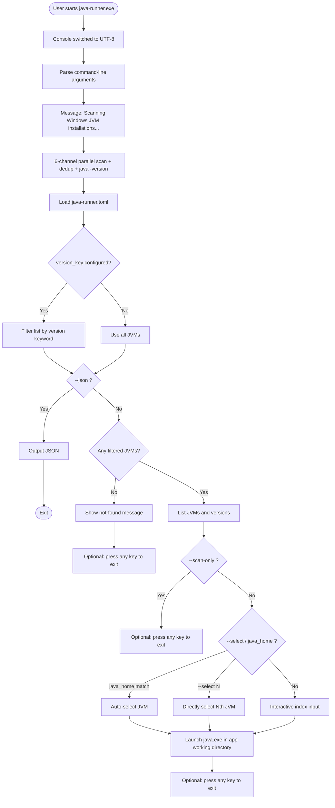
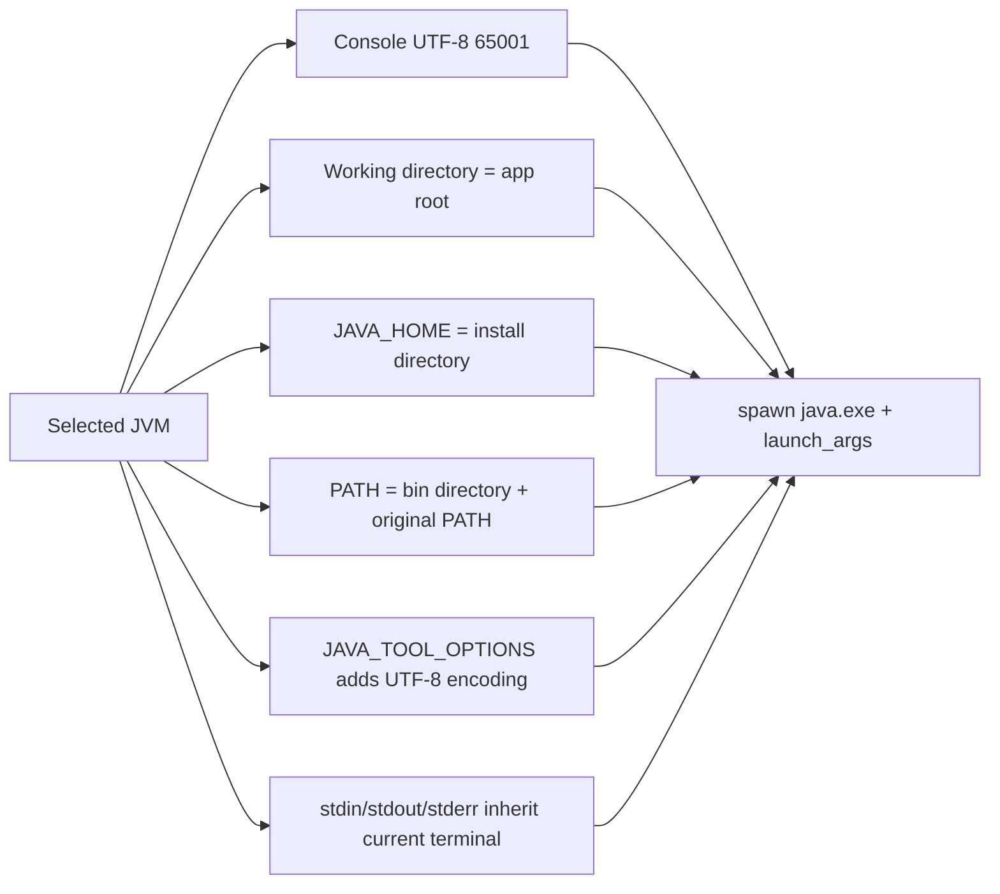
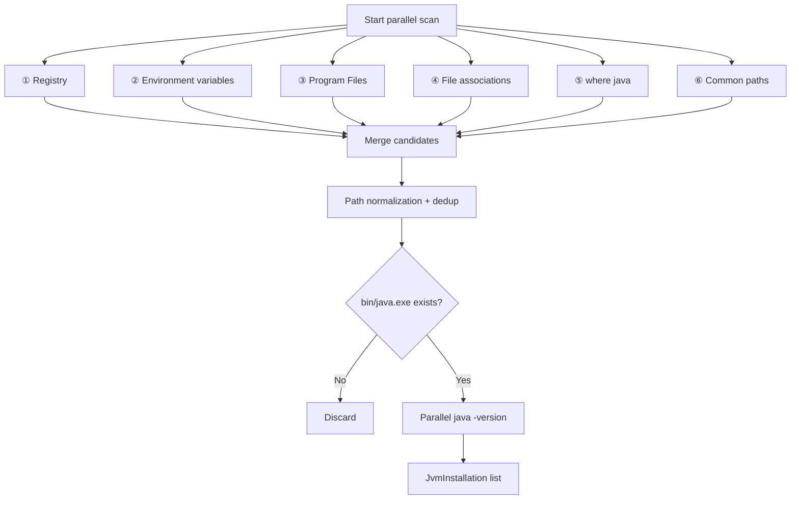
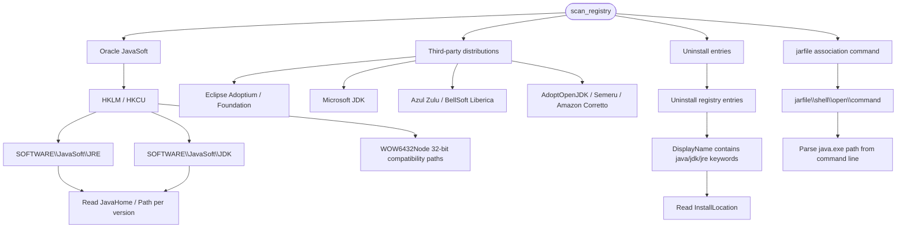
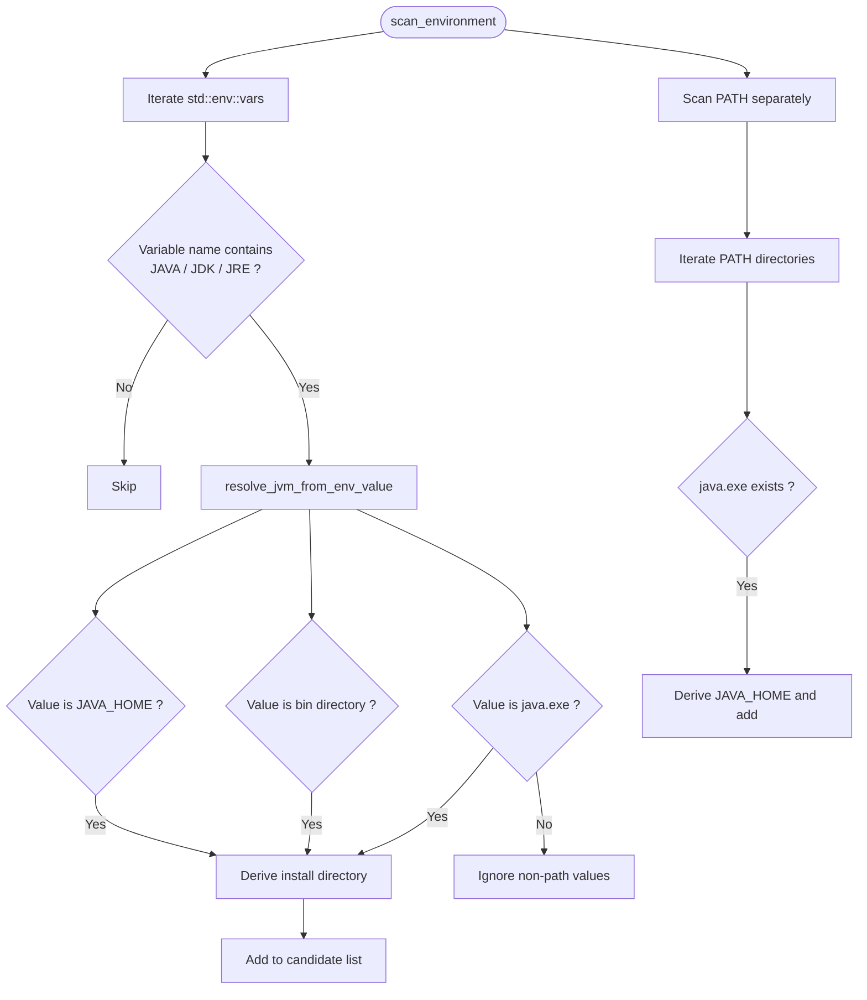
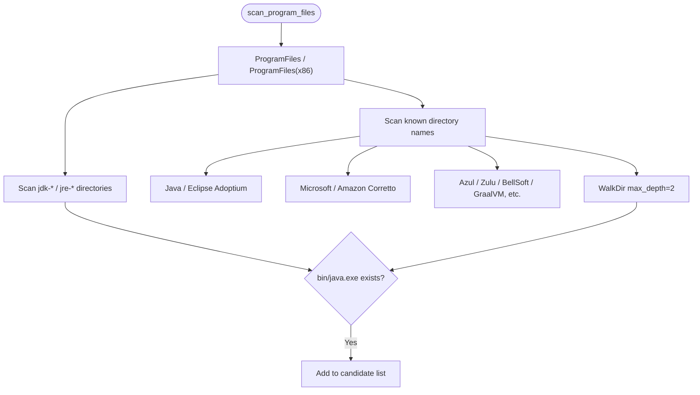
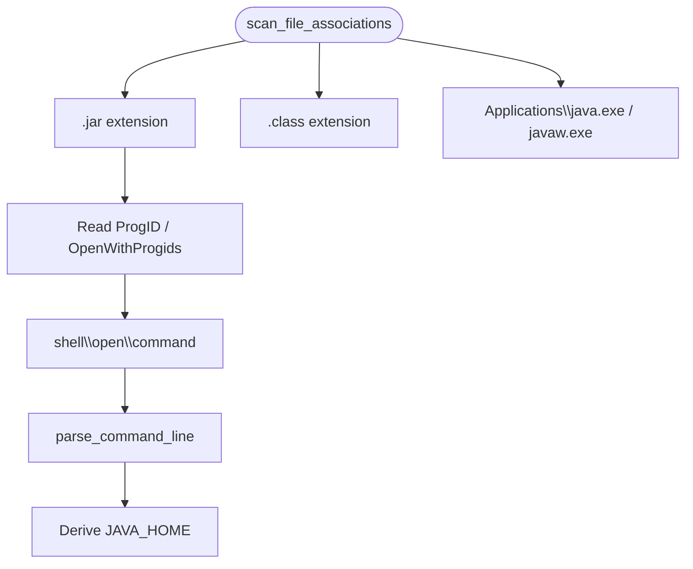
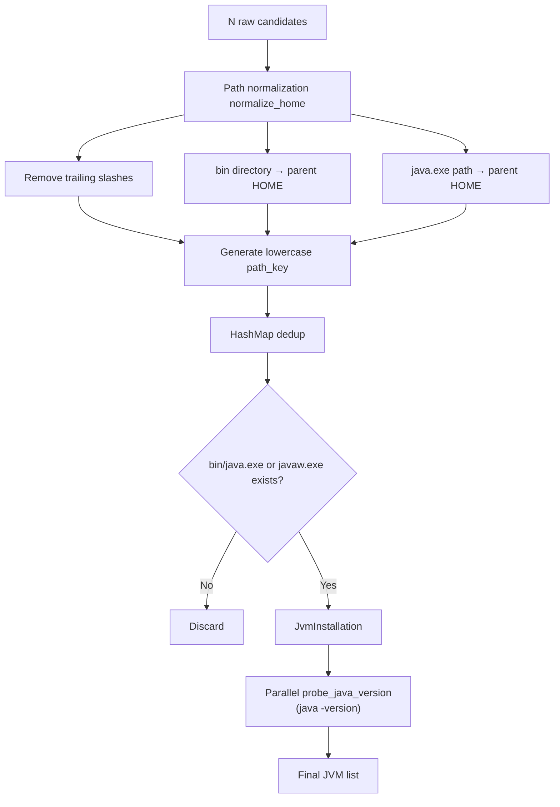

# java-runner User and Implementation Guide

> Chinese version: [guide_cn.md](guide_cn.md) · Built HTML/PDF go to `dist/doc/` (shipped as `doc/` in the release package)

Windows command-line tool: scans local JVM installations, lets you select (or auto-match) one, and runs a configurable Java launch command in the **current terminal** using that JVM.

---

## Overall Flow



---

## Command-Line Arguments

| Argument | Description | Effect on interaction |
|----------|-------------|----------------------|
| `--json` | Output scan results as JSON | Skips selection, launch, and key press wait |
| `--scan-only` / `-s` | Scan and list JVMs only | Skips selection and launch |
| `--verbose` / `-v` | Show discovery source for each JVM | More detail in list/JSON |
| `--config` / `-c` | Specify config file path | Affects launch command and working directory |
| `--select N` | Directly select the Nth JVM (1-based) | Skips interactive input; takes priority over `java_home` |
| `--no-pause` | Do not wait for key press after completion | Suitable for terminals/scripts |

**Common examples:**

```powershell
java-runner.exe                          # Default interactive mode
java-runner.exe --scan-only              # List JVMs only
java-runner.exe --select 3               # Use the 3rd JVM directly
java-runner.exe --json                   # Script-friendly output
java-runner.exe --json -v                # JSON includes discovery sources
java-runner.exe --config my.toml         # Specify config
java-runner.exe --no-pause               # Do not wait for key press
```

---

## Language / Internationalization

The program picks its UI language from the **Windows user locale** (`GetUserDefaultLocaleName`):

| System locale | UI language |
|---------------|-------------|
| `zh*` (e.g. `zh-CN`, `zh_CN`) | Chinese |
| Any other locale | English |

Override with the **`JAVA_RUNNER_LANG`** environment variable (e.g. `zh-CN` or `en-US`). This affects `--help`, scan messages, interactive prompts, and error text. JSON output field names stay English.

```powershell
$env:JAVA_RUNNER_LANG = 'en-US'
java-runner.exe --help

$env:JAVA_RUNNER_LANG = 'zh-CN'
java-runner.exe --scan-only
```

Unless noted otherwise, the **User Interaction Scenarios** and **Common Errors** sections below show **English** program output (non-`zh*` locale).

---

## Configuration File

### Lookup Order

When `--config` is specified, the given path is used; otherwise the **first existing file** is chosen in this order:

1. `{exe directory}/java-runner.toml`
2. `{exe directory}/config/java-runner.toml`
3. `./java-runner.toml` (current working directory)
4. `./config/java-runner.toml`

If none are found, built-in defaults apply: `launch_args = ["-version"]`.

### Working Directory

When launching Java, the child process current directory (`current_dir`) is determined as follows:

- Config file is `…/config/java-runner.toml` → app root is the **parent** of `config`
- Config file is `…/java-runner.toml` → app root is the **directory containing** the config file
- No config file → prefer the `exe` directory

Therefore `-jar app.jar` and relative-path logs (e.g. `logs/gc.log`) are resolved relative to the app root.

### Configuration Options

| Option | Type | Description |
|--------|------|-------------|
| `java_home` | String (optional) | Installation path **fragment**, case-insensitive; auto-selected on match, skipping interaction |
| `version_key` | String (optional) | Version keyword; keeps only JVMs whose `java -version` output (version/product/runtime/vm) contains this keyword |
| `launch_args` | String **or** string array | Argument list after `java.exe` |

**`launch_args` formats:**

```toml
# Array (recommended, clear)
launch_args = ["-Xmx512m", "-jar", "magic-boot-1.0.jar"]

# Single string (write long args on one line; quote args containing spaces)
launch_args = "-version"

# Single-quoted literal (recommended for Windows paths; avoids TOML escape errors like \l)
launch_args = '-Xmx512m -Xloggc:logs/gc.log -jar magic-boot-1.0.jar'
```

> **Note:** In double-quoted strings, `\logs` is treated as a TOML escape sequence and causes parse failures. Use **single-quoted literals** or **array syntax** instead.

### Full Example (Deploying a JAR Service)

```toml
# Show Java 8 only
version_key = "1.8"

# Auto-select JVM whose path contains this fragment (skip interaction)
java_home = "jdk1.8.0_271"

# Long launch args (equivalent to run.bat)
launch_args = '-Xmx512m -Xms512m -Xss512k -XX:PermSize=256m -XX:MaxPermSize=256m -Dfile.encoding=UTF-8 -Dsun.jnu.encoding=UTF-8 -Dsun.stdout.encoding=UTF-8 -Dsun.stderr.encoding=UTF-8 -Dlogging.charset.console=UTF-8 -server -Xloggc:logs/gc.log -Dserver.port=10087 -jar magic-boot-1.0.jar'
```

**Selection priority:** `--select N` > `java_home` auto-match > interactive index input.

---

## Environment Setup When Launching Java

After a JVM is selected, the following settings are applied before spawning the child process:



### Console Chinese Character Garbling

Frameworks such as Spring Boot often log in UTF-8, while the Windows console defaults to GBK, causing garbled text (e.g. `褰撳墠澶囦唤…`).

The program includes built-in mitigations:

1. Sets the console code page to **65001 (UTF-8)** at startup
2. Sets `JAVA_TOOL_OPTIONS` for the Java child process, including `-Dsun.stdout.encoding=UTF-8`, `-Dsun.stderr.encoding=UTF-8`, `-Dlogging.charset.console=UTF-8`, etc.

Double-click **`java-runner.exe`** directly (the program sets the UTF-8 code page at startup). If garbling persists, try again in a freshly opened CMD window.

---

## User Interaction Scenarios

### Scenario 1: No JVM Found

```
Scanning Windows JVM installations...

No Java installation was detected on this machine. Install Java and run this program again.

Press any key to exit...
```

If `version_key` is configured but nothing matches: `No JVM whose version output contains "…". Check version_key or install the matching Java version.`

### Scenario 2: Normal Interactive Flow

```
Scanning Windows JVM installations...

Found 6 JVM(s) (25 raw candidate(s), scan took 320ms)

[1] D:\java\jdk1.8.0_271
    java.exe: D:\java\jdk1.8.0_271\bin\java.exe
    Version: 1.8.0_271
    ...

Select a JVM (enter index):
> 1

Using JVM: D:\java\jdk1.8.0_271 (1.8.0_271)
Command: D:\java\jdk1.8.0_271\bin\java.exe -Xmx512m ... -jar magic-boot-1.0.jar

... Java program output ...

Press any key to exit...
```

### Scenario 3: `java_home` Auto-Selection

After configuring `java_home = "jdk1.8.0_271"`:

```
Using java_home match [6] D:\java\jdk1.8.0_271
Using JVM: D:\java\jdk1.8.0_271 (1.8.0_271)
Command: ...
```

### Scenario 4: JSON Output (`--json`)

```json
{
  "count": 6,
  "raw_candidates": 25,
  "elapsed_ms": 320,
  "jvms": [
    {
      "home": "D:\\java\\jdk1.8.0_271",
      "java_exe": "D:\\java\\jdk1.8.0_271\\bin\\java.exe",
      "version": "1.8.0_271",
      "product": "java",
      "runtime": "Java(TM) SE Runtime Environment ...",
      "vm": "Java HotSpot(TM) 64-Bit Server VM ..."
    }
  ]
}
```

With `--verbose`, each JVM additionally includes a `sources` array of discovery sources.

---

## Exit and Key-Press Wait

| Scenario | Wait for key press? |
|----------|---------------------|
| No JVM found | Yes (unless `--no-pause`) |
| `--scan-only` completed | Yes |
| Java program finished | Yes |
| Runtime error | Yes |
| `--json` | No |
| `--no-pause` | No |

---

## JVM Discovery Scan Flow

The program collects candidate paths through **6 parallel scan channels**, then applies **normalization, deduplication, and validity checks** to produce a unique JVM list, and runs `java -version` on each JVM to obtain the real version.



### Overview of the Six Scan Channels

| Channel | Module | Discovery source label |
|---------|--------|------------------------|
| ① Registry | `registry.rs` | Registry |
| ② Environment variables | `environment.rs` | Environment variable / PATH |
| ③ Program Files | `program_files.rs` | Program Files |
| ④ File associations | `associations.rs` | File association |
| ⑤ where java | `associations.rs` | where java |
| ⑥ Common paths | `common_paths.rs` | Common path |

---

### ① Registry Scan

Reads Java installation information from the Windows registry, covering Oracle official releases and mainstream distributions. In `--verbose` mode, specific registry paths are shown.



| Scan item | Example registry location | Fields read |
|-----------|----------------------------|-------------|
| Oracle JRE/JDK | `HKLM\SOFTWARE\JavaSoft\JDK\<version>` | `JavaHome`, `Path`, `InstallationPath` |
| Eclipse Adoptium | `HKLM\SOFTWARE\Eclipse Adoptium\JDK\<version>` | `Path`, `JavaHome` |
| Microsoft JDK | `HKLM\SOFTWARE\Microsoft\JDK\<version>` | `Path`, `JavaHome` |
| Azul Zulu | `HKLM\SOFTWARE\Azul Systems\Zulu\<version>` | `InstallationPath`, `JavaHome` |
| Uninstall entry | `HKLM\...\Uninstall\{GUID}` | `InstallLocation` (DisplayName must contain Java keyword) |
| JAR association | `HKCR\jarfile\shell\open\command` | Command-line string |

Each channel scans **HKLM, HKCU**, and **WOW6432Node** (32-bit compatibility) paths.

---

### ② Environment Variable Scan

Iterates all environment variables visible to the current process, identifies names containing Java-related keywords, and separately scans `PATH`.



**Variable name matching rule:** Names (case-insensitive) containing `JAVA`, `JDK`, or `JRE` are included in the scan.

**Typical variable names:** `JAVA_HOME`, `JDK17_HOME`, `PENTAHO_JAVA_HOME`, `JAVA8_HOME`, etc.

**Supported value forms:**

| Value type | Example | Handling |
|------------|---------|----------|
| JAVA_HOME | `D:\java\jdk-17.0.11` | Used directly as install directory |
| bin directory | `D:\java\jdk-17.0.11\bin` | Parent directory used as install directory |
| java.exe | `D:\java\jdk-17.0.11\bin\java.exe` | Two levels up used as install directory |
| Non-path value | `-Xmx512m` | Ignored |

`%VAR%` in environment variable values is expanded before parsing.

---

### ③ Program Files Scan

In parallel, scans `Program Files` and `Program Files (x86)` (if present), searching known Java directory names with a depth limit of **2 levels** for `bin\java.exe`.



**Known top-level directory names:** `Java`, `Eclipse Adoptium`, `Microsoft`, `Amazon Corretto`, `Azul`, `Zulu`, `BellSoft`, `Liberica`, `AdoptOpenJDK`, `GraalVM`, `Semeru`, `OpenJDK`, `jdk`, `jre`, etc.

**Direct scan under Program Files roots:** Subdirectories whose names start with `jdk`/`jre`, or contain `java`, `corretto`, or `graalvm`.

---

### ④ File Association Scan

Uses Windows file type associations to parse `java.exe` paths from `.jar`, `.class` open handlers, and `Applications\java.exe`.



**Registry locations checked (HKCR):**

- `{ProgID}\shell\open\command` (from `.jar` / `.class` ProgID)
- Each ProgID under `.jar` / `.class` `OpenWithProgids`
- `Applications\java.exe\shell\open\command`
- `Applications\javaw.exe\shell\open\command`

---

### ⑤ where java Scan

Invokes the system `where java`, parses each output line for the full `java.exe` path, and derives `JAVA_HOME`.


Reflects Java found on the **current process PATH**; complements channel ② PATH scanning (different implementation path).

---

### ⑥ Common Path Scan

Predefined common manual install paths; when a directory exists, checks itself and **one level of subdirectories** for `bin\java.exe`.

```
C:\Java
C:\jdk / C:\jre / C:\openjdk
C:\Program Files\Java
C:\Program Files\Eclipse Adoptium
C:\Program Files\Amazon Corretto
C:\Program Files\Microsoft
C:\Program Files\Zulu
C:\Program Files\BellSoft
C:\Program Files\GraalVM
D:\Java
D:\jdk
D:\Program Files\Java
```

Portable / green JDK installs outside these paths rely on the registry or environment variable channels for discovery.

---

### Candidate Merge and Deduplication

The six channels produce raw candidates (`JvmCandidate`); merge steps:



**Dedup rule:** The same path (case-insensitive, e.g. `D:\Java` and `D:\java`) is merged into one entry, **keeping all discovery sources** (viewable with `--verbose`).

**Validity check:** `{HOME}\bin\java.exe` or `{HOME}\bin\javaw.exe` must exist; otherwise the candidate is discarded.

---

### Version Probing

For each valid JVM, run in parallel:

```
"<JAVA_HOME>\bin\java.exe" -version
```

Parse stderr output:

| Field | Example source |
|-------|----------------|
| `version` | `"17.0.11"` / `"1.8.0_271"` |
| `product` | `openjdk` / `java` |
| `runtime` | `OpenJDK Runtime Environment ...` |
| `vm` | `OpenJDK 64-Bit Server VM ...` |

If `java -version` fails, the JVM is still listed but the version shows as "execution failed".

**Data structure:**

```
JvmInstallation
├── home          # JVM install directory (JAVA_HOME)
├── java_exe      # Full path to java.exe
├── version_info  # Parsed java -version result
└── sources[]     # Discovery source list (type + detail)
```

---

### Performance

| Feature | Description |
|---------|-------------|
| Parallel scan | 6 channels via Rayon |
| Parallel version probing | `java -version` per JVM in parallel |
| Depth limit | Program Files WalkDir max_depth=2 |
| Typical duration | ~100ms–1s (depends on JVM count) |

---

### Troubleshooting When No JVM Is Found

Check in the following order, and use `--verbose` to inspect each JVM's `sources` details:

| Step | Check | Description |
|------|-------|-------------|
| 1 | JDK/JRE installed on this machine | Confirm `{HOME}\bin\java.exe` actually exists |
| 2 | `java-runner.exe --scan-only -v` | If **0 candidates**: none of the six channels matched; if **candidates >0 but list empty**: paths have no valid `java.exe` |
| 3 | Registry | Run `reg query HKLM\SOFTWARE\JavaSoft\JDK`, etc., and confirm `JavaHome` has a value |
| 4 | Environment variables | Confirm `JAVA_HOME` is set; name contains JAVA/JDK/JRE; value is a valid path |
| 5 | PATH | Run `where java` in a shell and compare with channel ⑤ results |
| 6 | Install location | Green/portable edition outside directories listed in common path scan |
| 7 | Permissions | When running as a normal user, some HKLM or Program Files directories may be unreadable |
| 8 | `version_key` filter | If `version_key` is set but nothing matches, message shows `No JVM whose version output contains "…"` — first run `--scan-only` without filtering to confirm discovery |
| 9 | javaw.exe only | Rare environments have only `javaw.exe`; the program supports this; discarded if neither exists |

**Manually verify a single JVM:**

```powershell
# Replace with actual path
& "D:\java\jdk1.8.0_271\bin\java.exe" -version
```

If manual execution works but scanning does not, record the install path and source info from `--verbose` output, and compare against the six channels above to identify the missing step.

---

## Deployment Example: Bundled with a JAR

Typical directory layout (e.g. application directory):

```
app/
  java-runner.exe       # double-click to run
  magic-boot-1.0.jar
  config/
    java-runner.toml    # Launch config
  logs/                 # create manually if launch_args reference relative log paths
```

The program resolves `java-runner.toml` / `config/java-runner.toml` relative to the **exe directory**; no wrapper batch file is required for working directory or code page.

**Updating the exe:** If you see "cannot replace", `java-runner.exe` is still running. Close related windows first, or run an update batch script in the program directory (Chinese releases may ship `更新java-runner.bat`, which terminates the process before copying).

---

## Icon Build

Multi-resolution icons come from pre-rendered PNGs under `素材/` (see `scripts/build_icon.py`; not single-image scaling):

```
素材/icon_16x16.png … icon_256x256.png
  → assets/java-runner.ico (embedded in exe)
  → assets/icon-sizes/icon_*.png
```

```powershell
python scripts/build_icon.py
cargo build --release
```

---

## Documentation Build

**Sources** (Markdown only in the repo):

| Path | Description |
|------|-------------|
| `doc/guide_cn.md` | Chinese guide |
| `doc/guide_en.md` | English guide (this file) |

**Build outputs** (HTML / PDF — not stored under `doc/`):

| Path | Description |
|------|-------------|
| `dist/doc/` | Local preview: `guide_*.html`, `guide_*.pdf`, `index.html` |
| `dist/java-runner/doc/` | Shipped docs (generated during packaging) |

```powershell
pip install -r requirements.txt

# HTML + PDF under dist/doc/
python scripts/build_docs.py

# PDF only
python scripts/build_doc_pdf.py
```

Shared conversion: `scripts/doc_common.py`. Root `README.md` is **not** copied into the release `doc/` folder.

---

## Packaging for Release

```powershell
cargo build --release
python scripts/package_release.py   # builds docs into dist/java-runner/doc/
```

Run `python scripts/build_docs.py` first if you want to preview under `dist/doc/`.

Output: `dist/java-runner/` with exe, config, `doc/` (HTML/PDF only), and helper batch files (`查看文档.bat`, `更新java-runner.bat`).

---

## Common Errors

| Error (English UI) | Cause |
|--------------------|-------|
| No Java installation was detected… | Empty scan results |
| No JVM whose version output contains "…" | No match for `version_key` |
| java_home = "…" did not match any installed JVM | No install matches `java_home` fragment |
| Invalid index N | `--select` out of range |
| Failed to read config file … | TOML parse error (common: `\logs` inside double quotes) |
| Unable to access jarfile | Incorrect working directory or missing jar |
| Console garbled Chinese (Java app logs) | Old exe version or not running in a new UTF-8 console |

---

## Related Source Code

| Module | File | Responsibility |
|--------|------|----------------|
| Main flow | `src/main.rs` | Arguments, filtering, output |
| CLI / help | `src/cli.rs` | Localized clap command builder |
| Internationalization | `src/i18n.rs` | Locale detection, UI strings |
| JVM selection/launch | `src/launcher.rs` | Interaction, `java_home`, Java execution |
| Configuration | `src/config.rs` | TOML parsing, `launch_args`, working directory |
| Scan orchestration | `src/scan/mod.rs` | Six-channel parallel scan |
| Data model | `src/model.rs` | Dedup, `version_key` filtering |
| Utilities | `src/util.rs` | UTF-8 console, version probing |
| Config example | `config/java-runner.toml` | Default config |
| Icon script | `scripts/build_icon.py` | Generate ICO |
| Doc shared module | `scripts/doc_common.py` | Markdown conversion, guide definitions |
| Doc build | `scripts/build_docs.py` | Generate dist/doc/ HTML and PDF |
| Package script | `scripts/package_release.py` | Release directory |
